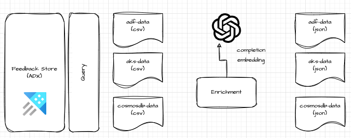
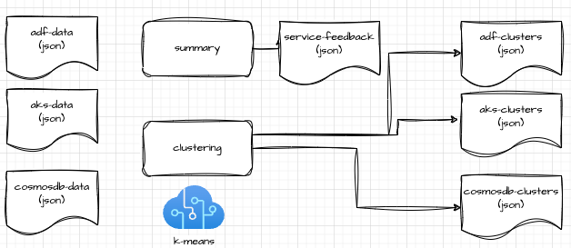

# Feedback AI Lens

**Feedback AI Lens** is an AI-powered tool designed to help product teams explore, analyze, and gain insights from customer feedback data. Leveraging Azure OpenAI, this tool processes raw feedback and generates structured user stories, aiding in customer need prioritization and product development decisions.

## Key Features

- **AI-Powered User Story Generation**: Automatically converts feedback data into user stories using Azure OpenAI.
- **Embedding and Similarity Search**: Uses embeddings to find similar feedback items based on cosine similarity.
- **CSV File Ingestion**: Supports importing customer feedback from CSV files for analysis.
- **Interactive Jupyter Notebooks**: Includes notebooks for research and feedback exploration with built-in functionality to process, embed, and analyze feedback data.
- **JSON Export**: Outputs processed feedback, including generated user stories, to a JSON format for further analysis.

> Note: there is also a CLI version of this tool read more about it [here](./src/console/README.md)

## High Level Architecture

Using `KQL` to extract service based data, the actual queries can be found in the `research.ipynb` notebook. The data is then processed and transformed into user stories using Azure OpenAI. The user stories are then embedded to facilitate similarity searches. The `summary.ipynb` and `clustering.ipynb` notebooks uses these embeddings for clustering feedbacks based on the embedding and the also create an aggregated view based on the feedback meta-data.

## Notebooks Overview

### 1. **Research Notebook** (`research.ipynb`)
   - **Objective**: Helps Azure product groups explore customer feedback to prioritize product roadmap features.
   - **Functionality**:
     - Loads customer feedback data from Azure Data Explorer (ADX).
     - Uses natural language processing (NLP) to transform raw feedback into user stories.
     - Researches and tests prompts to generate consistent, structured user stories in the format:
       `As a [persona], I want to [do something], so that I can [achieve something].`
     - Embeds feedback data to facilitate vector-based similarity searches.
   - **Technologies**:
     - Azure OpenAI
     - ADX for querying feedback data.
   - **Example Use Case**: Enables product managers to gather feedback from multiple customers on a specific issue and generate actionable user stories.



### 2. **Feedback Summarization and Clustering Notebook** (`summary.ipynb`, `clustering.ipynb`)
   - **Objective**: Leverages the pre-processed data from the `research.ipynb` notebook for feedback exploration.
   - **Functionality**:
     - Uses embeddings run k-means clustering.
     - Aggregate several key dimensions of the feedback data.
   - **Technologies**:
     - Azure OpenAI for embeddings.
     - Pre-processed feedback data from the research notebook.



## Installation

1. Clone the repository:
   ```bash
   git clone https://github.com/yodobrin/feedback-ai-lens.git
   ```

2. Navigate to the project directory:
   ```bash
   cd feedback-ai-lens
   ```

3. Install dependencies required by the notebooks and scripts.

4. Add your Azure OpenAI credentials in the configuration file (`src/configuration/.env`).

## Usage

1. Place your customer feedback CSV file in the specified directory (`./sample-data/`).
2. Open either of the notebooks:
   - Use `research.ipynb` for feedback processing and user story generation.
   - Use `summary.ipynb` & `clustering.ipynb` to understand how summary and clustering are calculated.
3. Run the cells to process the feedback and generate insights.
4. The output can be exported as a JSON file for further use.

## Example Queries

- **Search for similar feedback**: Given a user query, find feedback entries that share similar content and context.
- **Generate User Stories**: Automatically transform customer feedback into actionable user stories for product teams.

## Contributing

We welcome contributions! Please submit a pull request or open an issue for any suggestions or fixes.

## License

This project is licensed under the MIT License.

## Examples
sample query for demo: express a desire for features such as Azure CNI Overlay, Multus CNI, and IPv6 support

